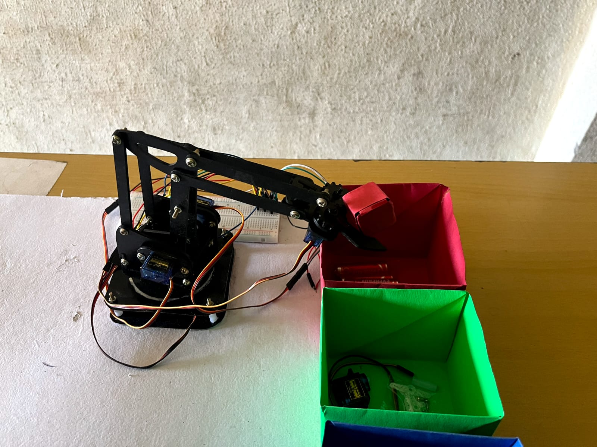

# Vision Assisted Robotic Arm Using Arduino


## Introduction
Welcome to the Vision Assisted Robotic Arm project! This project combines the power of computer vision and robotics to create an intelligent system capable of sorting objects by color. Utilizing an Arduino for control and OpenCV for image processing, this project demonstrates a seamless integration of hardware and software.
This system leverages the capabilities of the Arduino Uno R3 microcontroller to automate object sorting based on color recognition. Our proposed system is a testament to the fusion of robotics and computer vision, driven by the Arduino Uno R3, to automate and enhance object sorting by color. By utilizing this technology stack, we aim to
deliver a cost-effective and versatile solution that efficiently addresses the challenges posed by manual sorting processes across various industries. 

This innovative project merges the realms of computer vision and robotics to create an intelligent system that contributes to sustainability by automating object sorting based on color recognition. By harnessing the power of an Arduino Uno R3 microcontroller for control and OpenCV for image processing, our system demonstrates a seamless integration of hardware and software.

Our sustainable approach aims to:
- Reduce manual labor and human error in object sorting processes.
- Optimize resource utilization through automated, efficient sorting mechanisms.
- Contribute to environmental conservation by promoting efficient and eco-friendly practices.
- Enable cost-effective solutions for industries seeking streamlined sorting processes.

This project not only showcases the capabilities of technology but also emphasizes our commitment to sustainable innovation and addressing real-world challenges in a responsible manner.


## Features
- **Color-Based Sorting**: Automatically sorts objects based on their color.
- **Real-Time Processing**: Uses OpenCV for real-time image processing.
- **Arduino Controlled**: All movements are controlled via an Arduino board.
- **High Precision**: Achieves accurate and repeatable movements.
- **Comprehensive Documentation**: Includes detailed design diagrams and code explanations.

## Hardware Requirements
- Arduino Uno
- USB Cable for Arduino
- SG90 Servo Motor
- Webcam (compatible with OpenCV)
- Breadboard and jumper wires
- Power supply 
- Mechanical parts for the robotic arm (3D printed or otherwise)
- Gripper (3D printed or purchased)
- Screws, nuts, and bolts for assembly

## Software Requirements
- [Arduino IDE](https://www.arduino.cc/en/Main/Software)
- [Python 3.x](https://www.python.org/downloads/)
- [OpenCV](https://opencv.org/) (`pip install opencv-python`)
- CAD software for viewing `.dwg` files (e.g., AutoCAD)
- 3D printer software (if printing parts)


## Installation
### Prerequisites
Make sure you have the following software installed:
- [Arduino IDE](https://www.arduino.cc/en/Main/Software)
- [Python 3.x](https://www.python.org/downloads/)
- [OpenCV](https://opencv.org/) (`pip install opencv-python`)
- CAD software for viewing `.dwg` files (e.g., AutoCAD)
- A 3D printer for printing the gripper (optional)
  

### Steps
1. **Clone the Repository**:
   ```sh
   git clone https://github.com/yourusername/Vision-Assisted-Robotic-Arm.git
   

2. **Set Up Arduino**:
  Open Code/Arduino/main.ino in the Arduino IDE.
  Connect your Arduino board to your computer.
  Upload the code to the Arduino.

3. **Set Up Python Environment**:
  Navigate to the Code/Python/ directory.
  Install the required Python packages:
    ```sh
    pip install -r requirements.txt

## Usage

1. **Start the System**:
   - Power on the Arduino and run the Python script.
   - Place objects in the designated area for sorting.

2. **Observe the Robotic Arm**:
   - Watch as the arm detects and sorts objects based on their color in real-time.

## Design Diagrams

- **3D Model of System Overview**
  

- **2D Drafting of Arm**
  

- **Robotic Arm Pin Diagram**
  

- **Robotic Arm Circuit Diagram**
  


## Working Demonstrations

- **Arm in Action**
  

- **Searching for Object**
  

- **Picking Up Object**
  

- **Dropping Object**
  

- **Simulation Video**
  []
